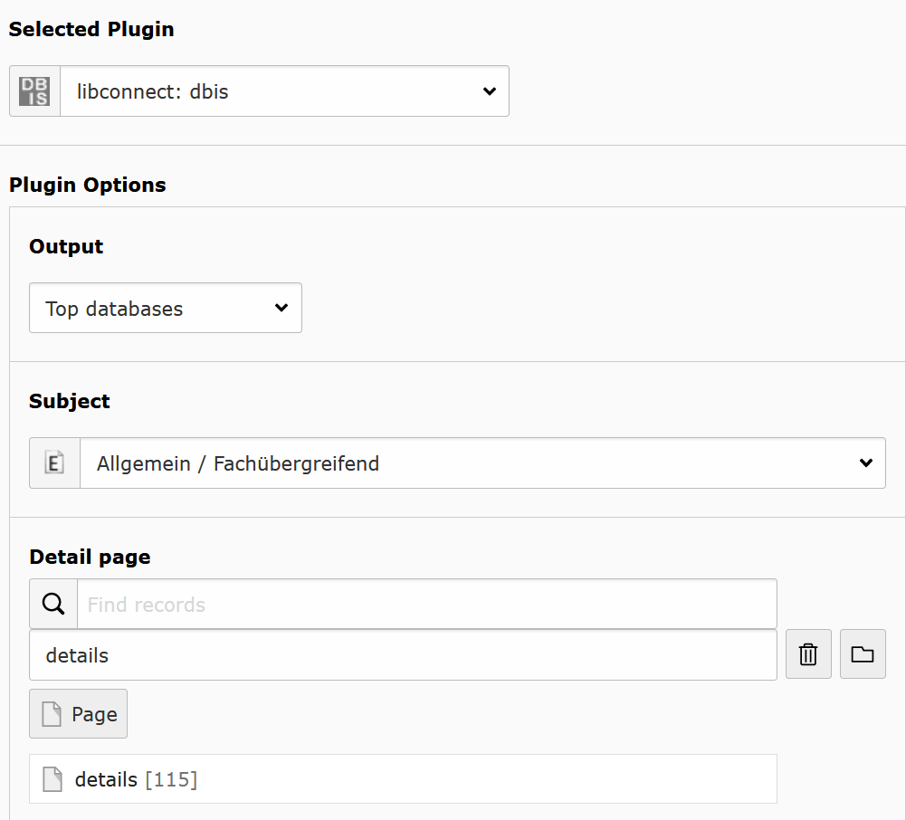
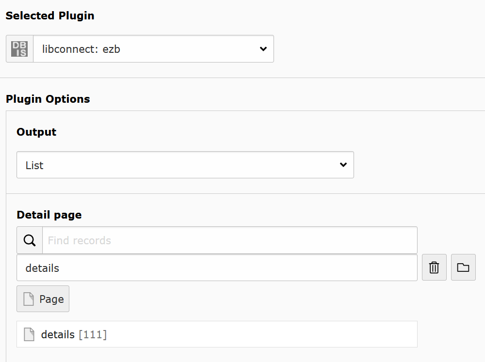
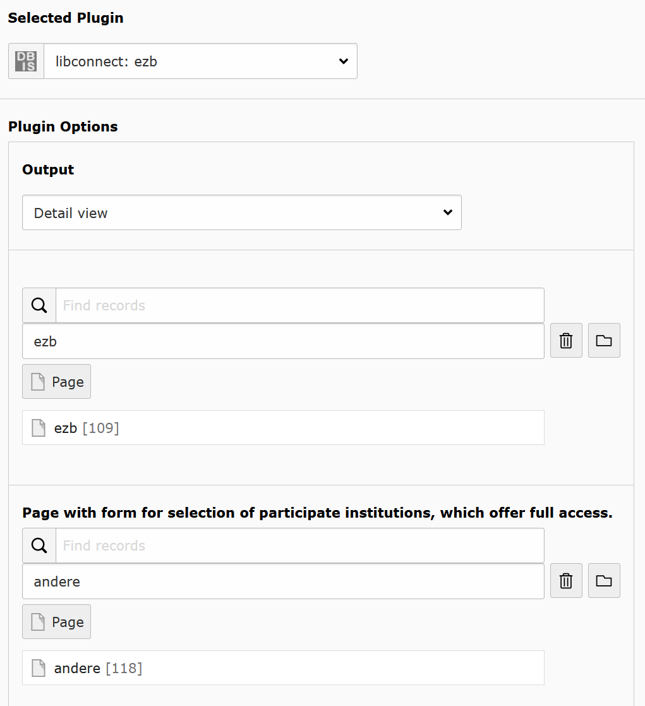
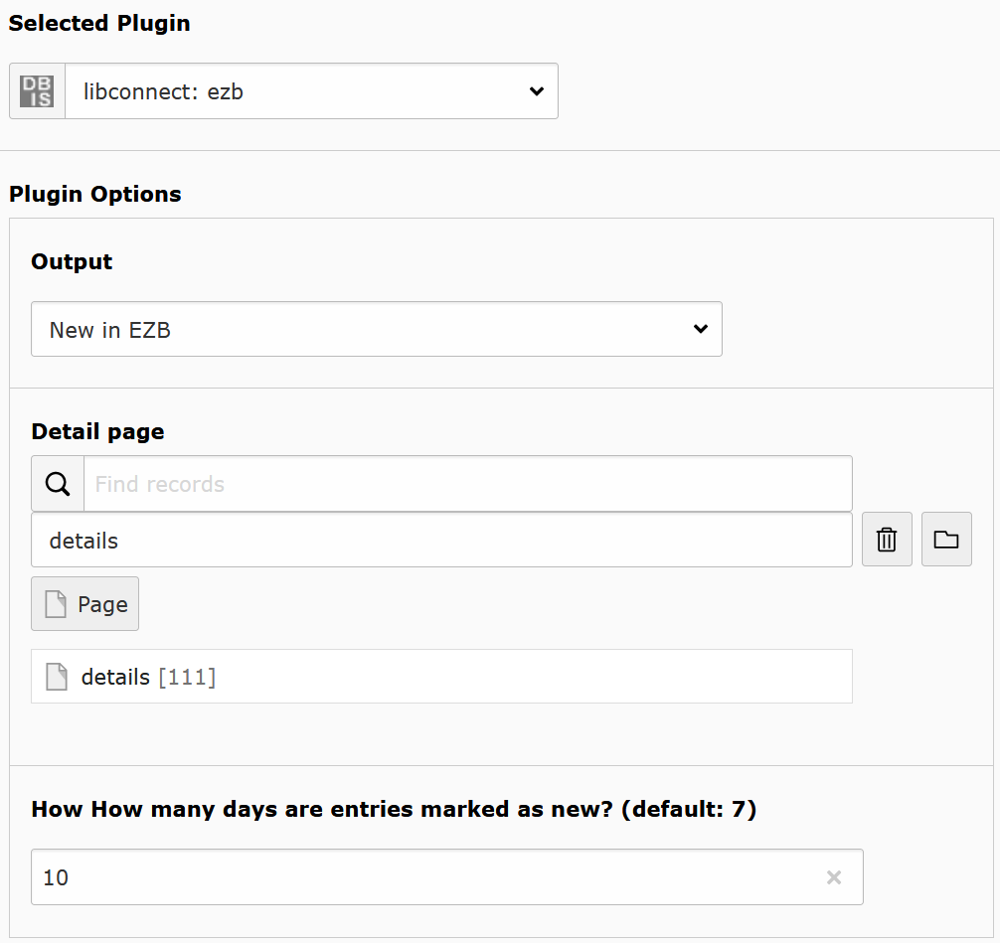
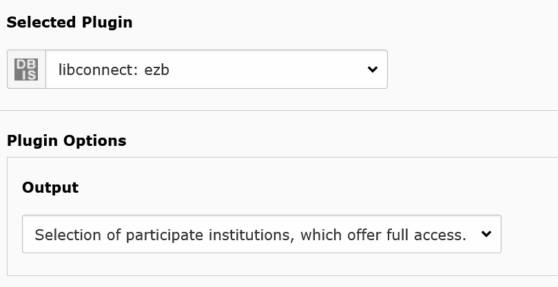

.. include:: ../Includes.txt

.. _for-editors:

===========
For Editors
===========

Target group: **Editors**

Libconnect is easy to use.

DBIS
====

Add the plug-in DBIS. Now you can choose with "Ausgabe" the output with the following options:

* Top-Datenbanken
* Liste
* Detailansicht
* Sidebar-Suchformular
* Neu in DBIS

Every entry change the other available options.

Top-Datenbanken - Top databases
-------------------------------

It generates a list with the top databases of a subject.

Fachgebiet: Choose a subject.

Detailseite: Choose a detail page.

   Configuringg the list for top databases.

Liste - List
------------

Generates a list of datbases and links to the detail page. It is also used for search results.

Detailseite: Choose a detail page.

Sortierung: Choose the sort by database type, name, access type. 

Zugangsinformationen: Choose which access information texts are displayed, long or short form.

   Configuring the output as list.

Detailansicht - Details
-----------------------

Shows the details of a database. Here is nothig to set.

   Set output for detail view.

Sidebar-Suchformular - sidebar
------------------------------

This is a search bar to use on top or as sidebar.

Listenausgabe: set page with dbis plug-in with output as list.

Seite mit Detailsuche: set page with search.

Wieviel Tage gelten Einträge als neu? (Standard: 7): set the number of days for "New in dbis" how long entries marked as new.

Neu in DBIS: set page with the "Neu in DBIS". Generates a link to "New in DBIS" with number of new entries. If you choose a subject in list, you get new entries for this subject too. If you donn´t want to use this feature, let it empty.

.. figure:: ../Images/Editor/DbisBackendSidebar.png
   :class: with-shadow
   :alt: output as sidebar
   :width: 300px

   Configuring the sidebar plug-in.

Neu in DBIS - new entries
-------------------------

It generats a list with all new databases. You decide how long is a database new.

Detailseite: Choose a detail page.

Sortierung: Choose the sort by database type, name, access type.

Wieviel Tage gelten Einträge als neu? (Standard: 7): set the number of days for "Neu in DBIS" how long entries marked as new.'

Zugangsinformationen: Choose which access information texts are displayed, long or short form.

.. figure:: ../Images/Editor/DbisBackendNew.png
   :class: with-shadow
   :alt: output as list with new entries
   :width: 300px

   Configuring the list for new entries.

EZB
===

Add the plug-in EZB. Now you can choose with "Ausgabe" the output with the following options:

* Liste
* Detailansicht
* Sidebar-Suchformular
* Neu in EZB
* Auswahl Teilnehmer die Vollzugriff bieten
* Kontakt

Every entry change the other available options.

Liste - List
------------

Generates a list of journals and links to the detail page. It is also used for search results.

Detailseite: Choose a detail page.

   Configuring the output as list.

Detailansicht - Details
-----------------------
Shows the details of a journal.

Listenausgabe: set page with ezb plug-in with output as list.

Seite mit Formular für Auswahl teilnehmender Institutionen, die Vollzugriff bieten: Set page with output of "Auswahl Teilnehmer die Vollzugriff bieten". On this page, the visitor get a form of libraries with full access to this yournal.
If you don´t want a page with this output, let it empty and the detail page generates a link to the form of the website `https://ezb.uni-regensburg.de <https://ezb.uni-regensburg.de>`__.

   Set output for detail view.

Sidebar-Suchformular - sidebar
------------------------------

This is a search bar to use on top or as sidebar.

Listenausgabe: set page with ezb plug-in with output as list.

Seite mit Detailsuche: set page with search.

Wieviel Tage gelten Einträge als neu? (Standard: 7): set the number of days for "New in ezb" how long entries marked as new.

Neu in EZB: set page with the "Neu in EZB". Generates a link to "Neu in EZB" with number of new entries. If you choose a subject in list, you get new entries for this subject too. If you donn´t want to use this feature, let it empty.

.. figure:: ../Images/Editor/EzbBackendSidebar.png
   :class: with-shadow
   :alt: output as sidebar
   :width: 300px

   Configuring the sidebar plug-in.

Neu in EZB - new entries
-------------------------

It generats a list with all new journals. You decide how long is a journal new.

Listenausgabe: set page with ezb plug-in with output as list.

Detailseite: Choose a detail page.

Wieviel Tage gelten Einträge als neu? (Standard: 7): set the number of days for "Neu in EZB" how long entries marked as new.'

   Configuring the list for new entries.

Auswahl Teilnehmer die Vollzugriff bieten
-----------------------------------------

Creates a for of libraries with full access to this yournal. The visitor choose the library and will be redirected to their page on https://ezb.uni-regensburg.de.

   Configuring the list for new entries.

Kontakt
-------

Shows the contact information which are set on `https://ezb.uni-regensburg.de <https://ezb.uni-regensburg.de>`__. Here is nothig to set.

