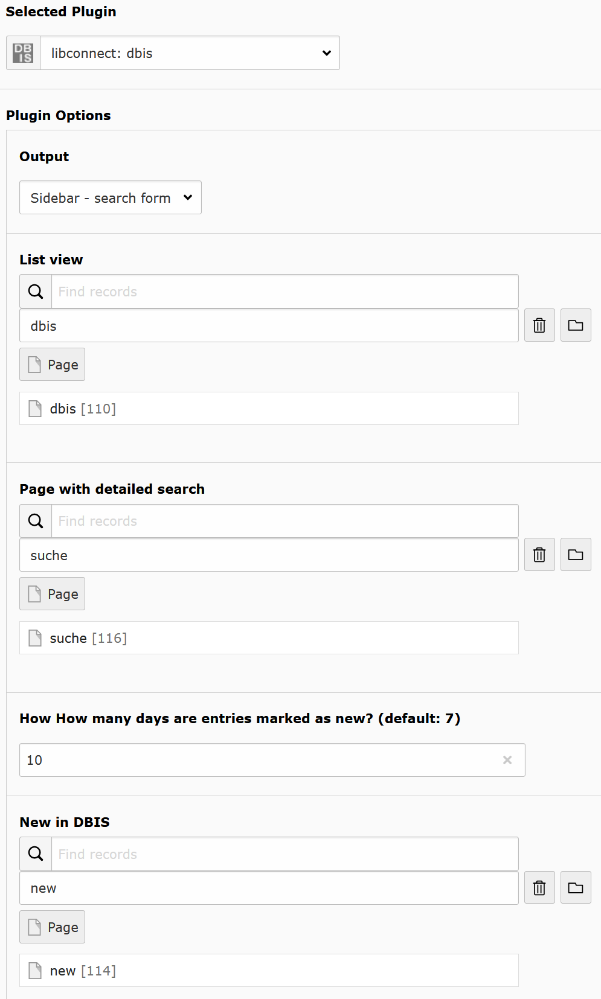
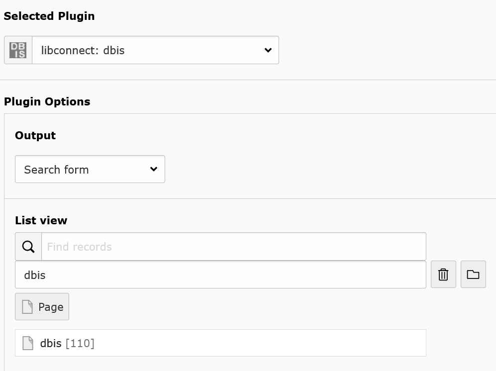
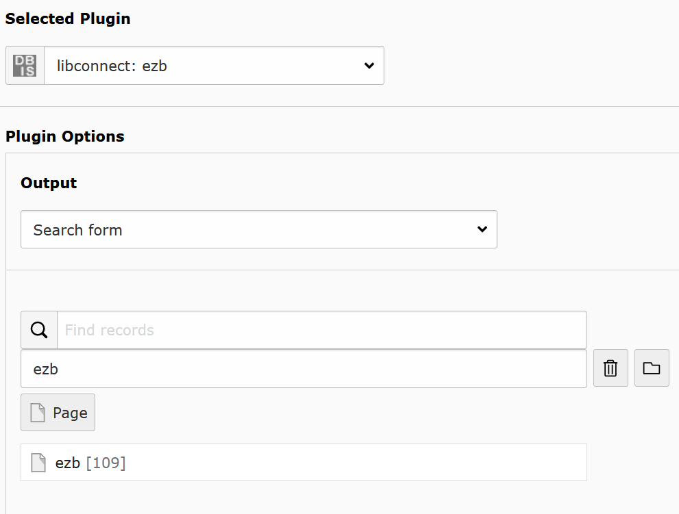

.. include:: ../Includes.txt

.. _for-editors:

===========
For Editors
===========

.. contents::
   :local:
   :depth: 2

Target group: **Editors**

Libconnect is easy to use.

DBIS
====

Add the plug-in DBIS. Now you can choose with "Output" the output with the following options:

* Top databases
* List
* Detail view
* Sidebar - search form
* Search form
* New in DBIS

Every entry change the other available options.

Top databases
-------------

It generates a list with the top databases of a subject.

Subject: Choose a subject.

Detail page: Choose a detail page.

.. figure:: ../Images/Editor/DbisBackendTop.png
   :width: 800px
   :alt: output as list

   Configuringg the list for top databases.

List
----

Generates a list of datbases and links to the detail page. It is also used for search results.

Detail page: Choose a detail page.

Sort: Choose the sort by database type, name, access type. 

Access information : Choose which access information texts are displayed, long or short form.

.. figure:: ../Images/Editor/DbisBackendList.png
   :width: 800px
   :alt: output as list

   Configuring the output as list.

Detail view
-----------

Shows the details of a database. Here is nothig to set.

.. figure:: ../Images/Editor/DbisBackendDetails.png
   :width: 800px
   :alt: output as detail view

   Set output for detail view.

Sidebar - search form
---------------------

This is a search bar to use on top or as sidebar.

List view: set page with dbis plug-in with output as list.

Page with detailed search : set page with search.

 How How many days are entries marked as new? (default: 7): set the number of days for "New in dbis" how long entries marked as new.

New in DBIS: set page with the "New in DBIS" output. Generates a link to "New in DBIS" with number of new entries. If you choose a subject in list, you get new entries for this subject too. If you donn´t want to use this feature, let it empty.

   Configuring the sidebar plug-in.

Search form
-----------

This is an extended search form.

List view: set page with dbis plug-in with output as list.

   Configuring the seach form.

New in DBIS
-----------

It generats a list with all new databases. You decide how long is a database new.

Detail page: Choose a detail page.

Sort: Choose the sort by database type, name, access type.

 How How many days are entries marked as new? (default: 7): set the number of days for "Neu in DBIS" how long entries marked as new.'

 Access information: Choose which access information texts are displayed, long or short form.

   Configuring the list for new entries.

EZB
===

Add the plug-in EZB. Now you can choose with "Ausgabe" the output with the following options:

* List
* Detail view
* Sidebar - search form
* Search form
* New in EZB
* Selection of participate institutions, which offer full access.
* Contakt

Every entry change the other available options.

List
----

Generates a list of journals and links to the detail page. It is also used for search results.

Detail page: Choose a detail page.

.. figure:: ../Images/Editor/EzbBackendList.png
   :width: 800px
   :alt: output as list

   Configuring the output as list.

Detail view
-----------
Shows the details of a journal.

 List view : set page with ezb plug-in with output as list.

 Page with form for selection of participate institutions, which offer full access.: Set page with output of "Auswahl Teilnehmer die Vollzugriff bieten". On this page, the visitor get a form of libraries with full access to this yournal. If you don´t want a page with this output, let it empty and the detail page generates a link to the form of the website `https://ezb.ur.de <https://ezb.ur.de>`__.

.. figure:: ../Images/Editor/EzbBackendDetails.png
   :width: 800px
   :alt: output as detail view

   Set output for detail view.

Sidebar - search form
---------------------

This is a search bar to use on top or as sidebar.

 List view : set page with ezb plug-in with output as list.

 Page with detailed search : set page with search.

 How How many days are entries marked as new? (default: 7): set the number of days for "New in ezb" how long entries marked as new.

New in EZB: set page with the "Neu in EZB". Generates a link to "Neu in EZB" with number of new entries. If you choose a subject in list, you get new entries for this subject too. If you donn´t want to use this feature, let it empty.

   Configuring the sidebar plug-in.

Search form
-----------

This is an extended search form.

List view: set page with dbis plug-in with output as list.

   Configuring the seach form.

New in EZB
----------

It generats a list with all new journals. You decide how long is a journal new.

Detail page: Choose a detail page.

How How many days are entries marked as new? (default: 7): set the number of days for "Neu in EZB" how long entries marked as new.'

.. figure:: ../Images/Editor/EzbBackendNew.png
   :width: 800px
   :alt: output as list with new entri

   Configuring the list for new entries.

Selection of participate institutions, which offer full access.
---------------------------------------------------------------

Creates a for of libraries with full access to this yournal. The visitor choose the library and will be redirected to their page on https://ezb.ur.de.

.. figure:: ../Images/Editor/EzbBackendParticipant.png
   :width: 800px
   :alt: output as list with new entries

   Configuring the list for new entries.

Contakt
-------

Shows the contact information which are set on `https://ezb.ur.de <https://ezb.ur.de>`__. Here is nothig to set.

