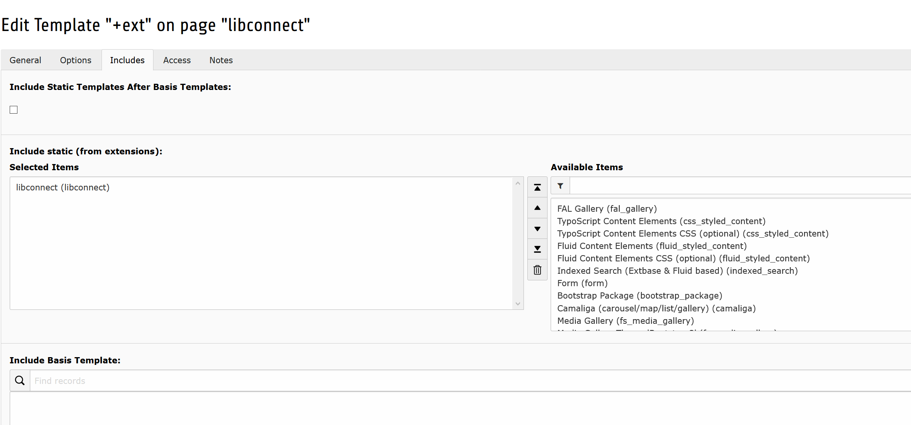
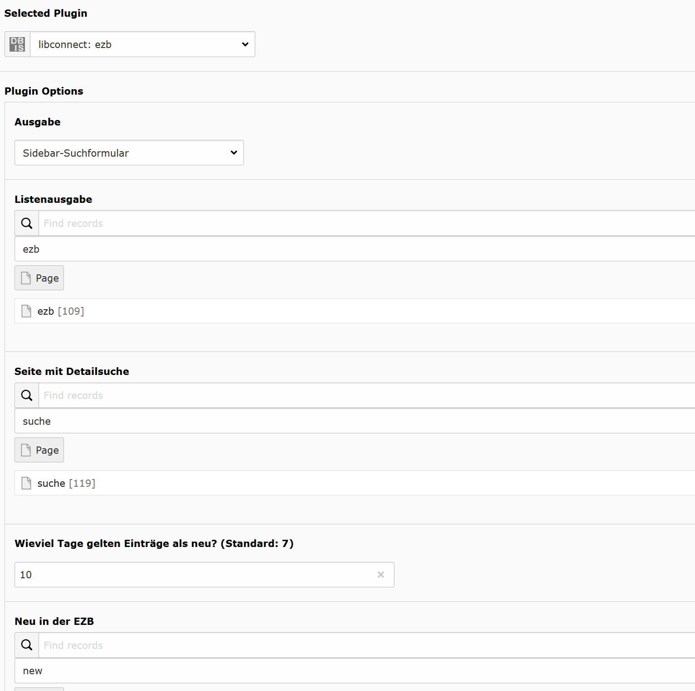
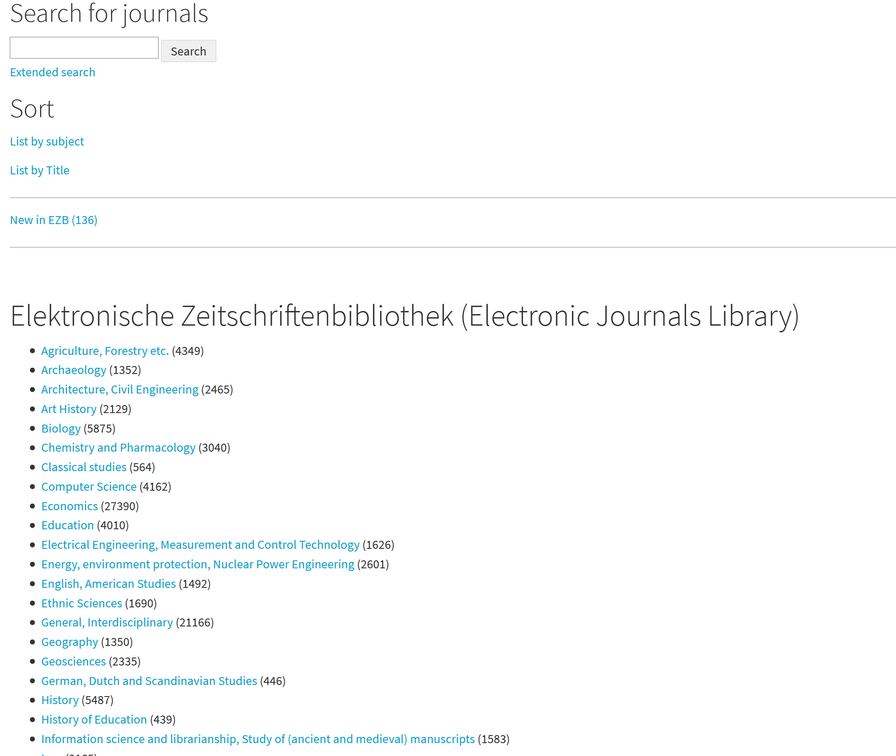
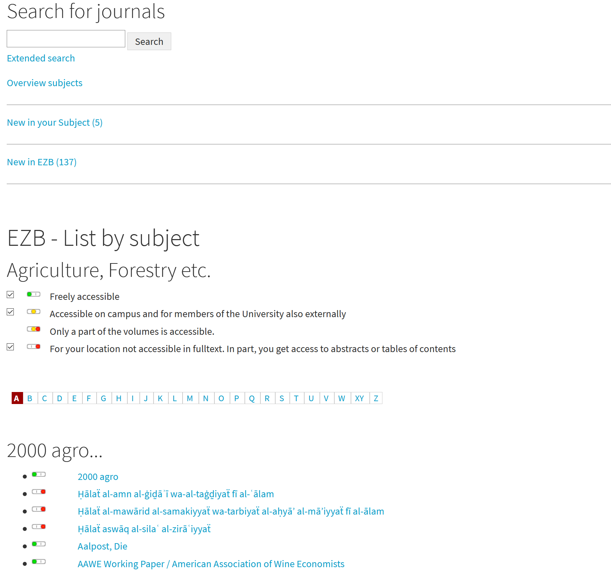
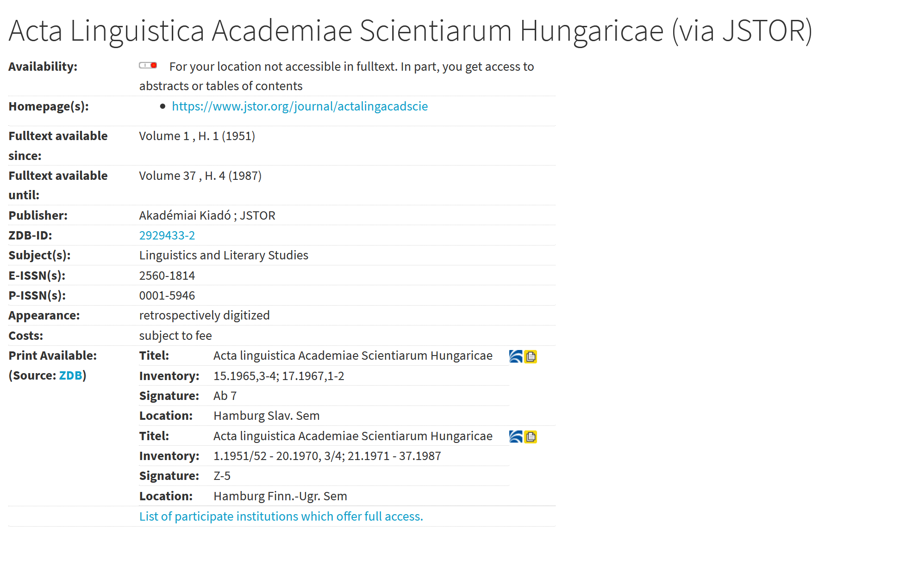
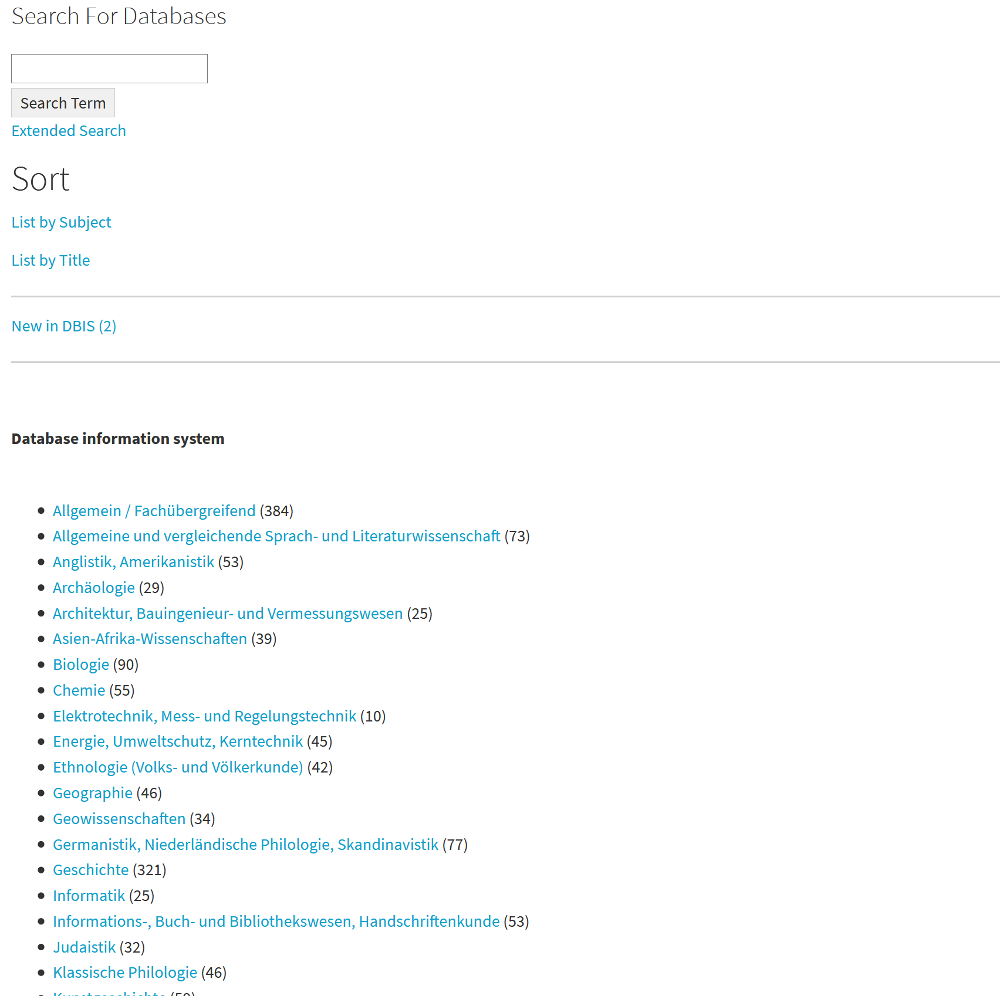
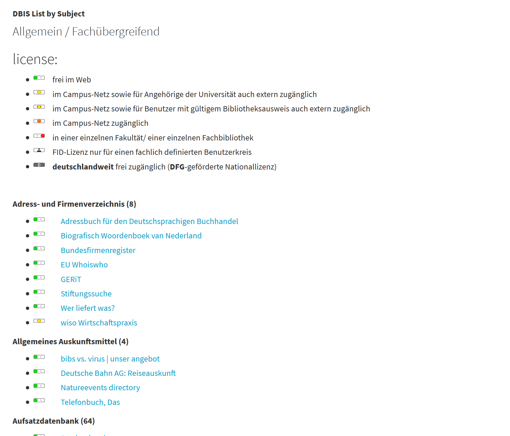
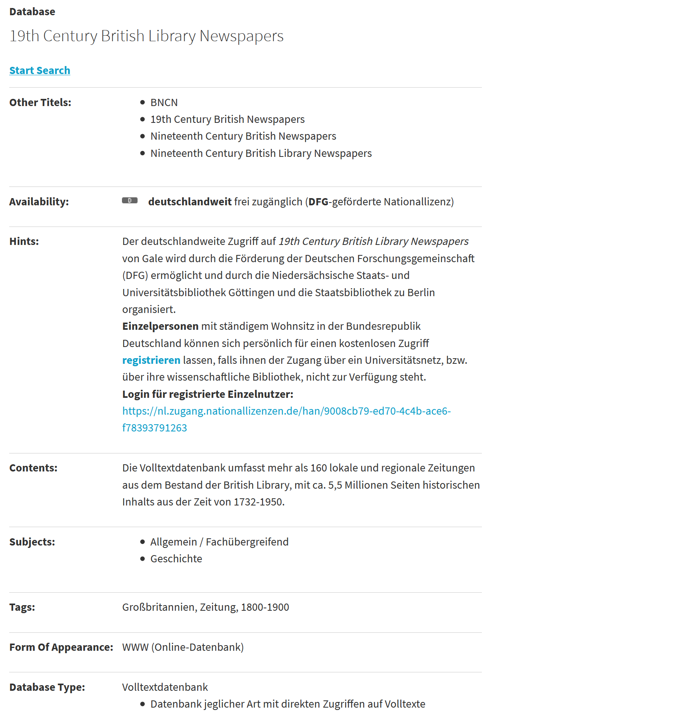

.. include:: ../Includes.txt

.. _introduction:

============
Introduction
============

What does it do?
================

With libconnect it is possible to display the information of Electronic Journals Library (EZB) and the Database informations system (DBIS) of the University Regensburg on an TYPO3 based website.

The visitors stay on your website and you can use your own styles.

Screenshots
===========

Here are some screenshots.

   Adding the static template.

   Configuring the sidebar or miniform plug-in.

   Adding the static template.

   Hers is the ezb sidebar, on top, and the list plug-in.

   Now is a subject selected.

   You can see the details of a journal.

   You can see the sidebar ton top and the list plug-in.

   Now is a subject selected.

   You can see the details of a database.

